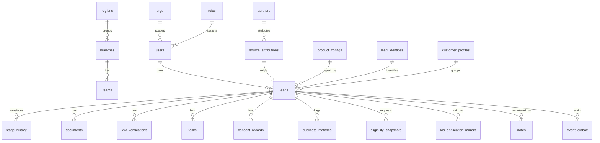

# Lead Management System (NBFC) — Data Model

**Source:** `docs/brd.md` (BRD v5.1, Gate A PASS) — §5 Holistic Data Model
**Target:** PostgreSQL 15+ / Google Cloud SQL
**Generated:** 2026-06-08
**Files:** `schema.sql` (canonical DDL) · `migrations/V1__initial_schema.sql` (Flyway, identical DDL)
**Scale:** 47 tables (46 BRD entities + 1 `orgs` infra seam) · 69 enum types · 89 indexes · 44 `updated_at` triggers
**Auth model:** application-level RBAC/ABAC (NestJS `EntitlementService`, BRD §4.7) — **not** Postgres RLS. No Supabase variant generated (see Design Decisions).

> This schema is a faithful translation of the signed-off BRD §5 (field-level entities, §5.4 ownership, §5.5 enum catalog, §5.6 integrity rules). No entities, fields, or enum values were invented beyond §5; deviations are limited to the documented `orgs` infra seam and six enum **type-name** renames (content identical).

---

## Entity Overview

Grouped by module (BRD §2.7 / §5.4 ownership). Standard columns on every business table: `org_id`, `created_at`, `updated_at`, `created_by`, `updated_by`; `version` where the BRD specifies optimistic locking.

| Module | Table | Description | Key relationships (FK) |
|---|---|---|---|
| infra | `orgs` | Single-tenant seam (reserved `org_id`, §4.3) | — (referenced by all) |
| M1 | `regions` | Region grouping branches | → orgs |
| M1 | `roles` | RBAC role + default scope | → orgs |
| M1 | `role_permissions` | Role → capability → max-scope | → roles |
| M1 | `branches` | Branch master + pin catchment | → regions |
| M1 | `users` | Internal/external system user | → roles, branches, teams, regions, partners, self (mgr) |
| M1 | `teams` | Sales team within a branch | → branches, users (manager) |
| M1 | `break_glass_grants` | Time-bound privileged access (FR-003) | → users (grantee, approver) |
| M10 | `partners` | DSA/dealer/connector/OEM master | → branches, users (mapped RM) |
| M2 | `customer_profiles` | Reusable customer shell | → orgs |
| M2 | `lead_identities` | Tokenised identity attributes (no raw Aadhaar) | → orgs |
| M2 | `source_attributions` | Source/campaign/partner lineage | → partners |
| M2 | `leads` | **Central lead record** | → product_configs, branches, teams, users(owner), source_attributions, lead_identities, customer_profiles, rejection_reasons, import_jobs, self(master) |
| M2 | `stage_history` | Append-only stage-transition read-model (single funnel/TAT source) | → leads, users(actor) |
| M2 | `import_jobs` | Bulk import summary (FR-010) | ← leads (import_job_id) |
| M3 | `duplicate_matches` | Lead↔Lead duplicate pairings (junction) | → leads (×2), users(action_by) |
| M4 | `allocation_rules` | Configurable allocation rule | → orgs |
| M5 | `product_configs` | Versioned product form/checklist/SLA/mapping | → orgs |
| M5 | `lead_product_details` | Product-specific answers (JSONB) | → leads, product_configs |
| M5 | `schemes` | Non-credit scheme/offer metadata | → orgs |
| M6 | `saved_views` | Saved lead queue/filter | → users(owner) |
| M6 | `notes` | Free-text internal lead note (FR-051) | → leads, users(author) |
| M7 | `customer_links` | Tokenised self-service link | → leads, users(revoked_by) |
| M8 | `documents` | Uploaded/retrieved document | → leads, users(verified_by) |
| M8 | `kyc_verifications` | KYC check + provider result | → leads, users(exc owner), integration_logs |
| M11 | `tasks` | Follow-up/operations task | → leads, users(owner), sla_policies |
| M11 | `communication_templates` | Versioned message template | → orgs |
| M11 | `communication_logs` | Sent message/call record | → leads, communication_templates |
| M11 | `notifications` | In-app notification | → users(recipient), leads |
| M11 | `notification_preferences` | Opt-in/out (subject polymorphic) | — (subject_ref: user|customer) |
| M12 | `consent_records` | Purpose-wise consent (append-only) | → leads, customer_profiles, self(superseded) |
| M12 | `data_sharing_logs` | Third-party data-sharing event | → leads, consent_records |
| M12 | `grievances` | Complaint / service request | → leads, users(owner) |
| M12 | `data_rights_requests` | DPDPA data-principal request | → customer_profiles, leads, users(owner) |
| M12 | `dla_registry` | DLA/LSP/partner compliance registry | → orgs |
| M12 | `retention_policies` | Retention rule by category/outcome | → orgs |
| M9 | `eligibility_snapshots` | Read-only LOS eligibility response | → leads |
| M9 | `los_application_mirrors` | Read-only LOS application status | → leads |
| M13 | `audit_logs` | Tamper-evident, hash-chained audit (append-only) | → users(actor), leads |
| M13 | `export_jobs` | Governed export request + artefact | → users(requested_by, approver) |
| M14 | `rejection_reasons` | Rejection reason/sub-reason master | → orgs |
| M14 | `sla_policies` | SLA threshold + escalation config | → orgs |
| M14 | `business_calendars` | Working-hours + holiday calendar for SLA/TAT (v5.2) | → branches/regions (scope); read by SLA engine |
| M14 | `configuration_versions` | Maker-checker config governance | → users(maker, checker), self(rollback) |
| M15 | `integration_logs` | Provider/API call observability | → leads |
| M15 | `webhook_subscriptions` | Outbound webhook endpoint config | → orgs |
| M15 | `event_outbox` | Transactional domain-event store | — (aggregate_id polymorphic) |

## Relationship Map

Full map is BRD §5.3. Core (mermaid):



M:N relationships are resolved by junction/lineage tables: Lead↔Lead via `duplicate_matches`; Role↔capability via `role_permissions`; subject↔purpose↔channel via `notification_preferences`.

## Design Decisions

- **UUID PKs** (`gen_random_uuid()` via pgcrypto) for all tables — matches BRD §4.3 (`*_id` is UUID, server-generated, immutable).
- **Native ENUM types** for all §5.5 controlled vocabularies (single source of truth; prevents the local-enum drift the BRD/council warned about). Enum value sets match §5.5 **exactly**.
- **Enum type-name renames** (content identical; six names suffixed to avoid SQL keyword/identifier clashes): `product → product_code`, `source → lead_source`, `channel → comm_channel`, `integration → integration_kind`, `direction → integration_direction`, `language → lang`.
- **Multi-tenancy seam:** every business table carries `org_id NOT NULL DEFAULT '…0001' REFERENCES orgs(id)`. `orgs` is an infra table (not a BRD entity) backing the BRD's reserved single-tenant `org_id` seam (§4.3). One default org is seeded. This satisfies consistent tenant isolation today and enables future multi-entity isolation without redesign.
- **`leads` product reference (resolves a council-flagged ambiguity):** `product_code` (denormalized enum, for fast report/filter and the §12 product funnel) **plus** `product_config_id` FK → `product_configs` (the exact pinned version row, which carries product_code + version). This cleanly replaces the BRD's ambiguous `product_id` + loose `product_config_version`.
- **Soft delete:** masters use `is_active` (branches, partners, schemes, configs, etc.); PII-bearing lead/customer rows that the retention engine (FR-115) anonymises/purges carry `deleted_at` (`leads`, `lead_identities`, `customer_profiles`, `documents`). Partial index `ix_leads_active … WHERE deleted_at IS NULL`.
- **Optimistic locking:** `version INTEGER` on `leads` (per §4.3/§5.6.7). Config rows are governed via `configuration_versions` rather than a per-row version.
- **Audit columns / deferred FKs:** `created_by`/`updated_by` → `users(user_id)`, declared `DEFERRABLE INITIALLY DEFERRED` so the BRD's atomic multi-entity writes and the seed bootstrap (system user references itself; roles reference the system user) commit cleanly. Append-only log tables use their own actor field instead (see below).
- **Append-only tables** (`consent_records`, `stage_history`, `audit_logs`) per §5.6.3/§5.2.35: INSERT-only by design, identified by `actor`/`actor_id`, **no** `updated_at` trigger. *Enforce* insert-only at deploy time via role grants (REVOKE UPDATE/DELETE) or a rule — see Assumptions #7.
- **Transactional outbox** (`event_outbox`, §5.6.4): written in the same DB transaction as the state change; `stage_history` + `audit_logs` + `event_outbox` are all written within the §10.3 stage-transition transaction.
- **Circular FKs** (`users`↔`teams`, `users`↔`partners`) created via `ALTER TABLE ADD CONSTRAINT` after both tables exist.
- **FK delete actions:** `CASCADE` for operational child-of-lead detail (documents, tasks, kyc, stage_history, notes, duplicate_matches, lead_product_details, eligibility/los mirror, customer_links); `RESTRICT` for **compliance evidence** (`consent_records`, `data_sharing_logs`) and master references (role, region, branch, product_config, lead_identity, source_attribution) and append-only actor references; `SET NULL` for optional references (owner, team, verified_by, approver, import_job, etc.). Leads use soft-delete (`deleted_at`), so these actions are defense-in-depth — lead rows are not hard-deleted in normal operation.
- **No Postgres RLS / Supabase variant:** the BRD auth model is application-level RBAC/ABAC via `EntitlementService` + JWT on NestJS (§4.7), deployed to Cloud Run + Cloud SQL (§4.1, `deploy-app` skill). Generating RLS policies would introduce a second, conflicting authorization model. Row scoping is enforced in the application/service layer per §4.7.
- **Naming convention:** primary business-relationship FKs are named `fk_<table>_<column>` with explicit `ON DELETE`; high-volume `org_id` and `created_by/updated_by` audit FKs are inline (auto-named) to keep a 46-table schema readable.

## Deployment Guide

### Cloud SQL (PostgreSQL 15)
```bash
gcloud sql connect <instance> --user=postgres --database=<db>
\i schema.sql
# or with Flyway:
flyway -url=jdbc:postgresql://<host>:5432/<db> -user=<u> -password=<p> migrate
```
Requires extensions `pgcrypto`, `pg_trgm`, `btree_gin` (created by the script; on Cloud SQL they are available by default).

### Local validation (recommended before Gate B sign-off)
```bash
# psql/pg_format were not available in the generation environment; validate before deploy:
psql -d postgres -c "BEGIN; \i schema.sql ROLLBACK;"
# or: pg_format --check schema.sql
```

## Evolving the Schema

Add new migrations as `migrations/V2__<change>.sql` (Flyway). Adding an enum value: `ALTER TYPE <enum> ADD VALUE '<new>'` (cannot run inside a transaction block with other DDL; isolate it). New shared field/enum must first be added to BRD §5/§5.5 and logged in the Amendments log (governance §14.5) before the migration.

## Assumptions & Gaps

| # | Assumption / Gap | Table / Field | Action required |
|---|---|---|---|
| 1 | `orgs` infra table added to back the reserved single-tenant `org_id` seam (not a BRD entity). One default org seeded. | `orgs`, all `org_id` | Confirm single-tenant for MVP; populate real org(s) when multi-entity is scoped. |
| 2 | Six enum **type names** renamed to avoid SQL keyword clashes (values unchanged). | `product_code`, `lead_source`, `comm_channel`, `integration_kind`, `integration_direction`, `lang` | Accept; downstream code/ORM uses these type names. |
| 3 | `leads.product_code` + `product_config_id` replace BRD `product_id`/`product_config_version` (resolves council ambiguity). | `leads` | Confirm; update any FR LLD that referenced `product_id`. |
| 4 | **Polymorphic columns have no FK** (app enforces): `notification_preferences.subject_ref` (user\|customer), `configuration_versions.config_ref` (any config row), `audit_logs.entity_id`, `event_outbox.aggregate_id`. | as listed | Confirm app-layer integrity checks; consider CHECK on subject_type pairing. |
| 5 | **Migration creation_channel deferred.** BRD §13.1 references a `migration` creation_channel, but §5.5 enum omits it and migration is a separate workstream (§2.5.6). Not added to the enum. | `creation_channel` | When data migration is scoped, add `'migration'` to the enum via BRD amendment + V2 migration. |
| 6 | **Consent-bootstrap deadlock NOT resolved in the model** (council finding). No `pre_consent_bootstrap` purpose was added — the lawful basis for the first outbound message is a Legal/DPO decision. | `consent_purpose` | Legal/DPO to decide the bootstrap basis; then amend BRD §5.5 + add enum value. |
| 7 | Append-only enforcement is by-convention in the DDL (no `updated_at` trigger; actor field). Not yet hardened at the DB layer. | `consent_records`, `stage_history`, `audit_logs` | Add `REVOKE UPDATE, DELETE` from the app role (or rules) at deploy to enforce insert-only. |
| 8 | `created_by`/`updated_by` and `org_id` FKs are inline/auto-named (not `fk_<t>_<col>`), and audit FKs are `DEFERRABLE`. | all business tables | Accept naming exception; deferral is required for atomic multi-entity writes. |
| 9 | Audit hash-chain serialization (council/Gate-A-9 risk): `audit_logs.prev_audit_hash` needs a single serializing writer; not enforced in schema. | `audit_logs` | Architecture stage: define a single audit-append consumer (e.g., off the outbox) — NFR-05 vs serial chain. |
| 10 | No `BusinessCalendar`/`WorkingHours` entity (council blind spot). SLA `threshold_minutes` are "business-hours aware" but the calendar is undefined. | `sla_policies` | Architecture/contracts stage: add a business-calendar source consumed by the SLA engine. |
| 11 | **RESOLVED.** `schema.sql` loaded clean on PostgreSQL 18 (target 15+) on 2026-06-08 via a throwaway DB with `ON_ERROR_STOP=1` (exit 0): 46 tables, 69 enum types, 43 triggers; seed committed (9 roles + system user), confirming the deferred-FK bootstrap works. All features used exist in PG 15. | whole file | None — syntax validation passed. |
| 12 | Only bootstrap reference data seeded (org, 9 roles, system actor). Master data (branches, teams, users, 7 product_configs, SLA policies, rejection reasons, templates, retention policies) loaded via FR-130/131. | seed | Load NBFC master data per §13.1 before go-live. |
| 13 | **Data-model addition:** `leads.import_job_id` (nullable FK → `import_jobs`, `ON DELETE SET NULL`) added to realize the §5.3 `ImportJob 1→* Lead` relationship (bulk-import traceability). Not in BRD §5.2.8 field list. | `leads` | Reflect in BRD §5.2.8 at next amendment, or accept as a physical-layer realization. |
| 14 | `data_sharing_logs.lead_id` set to `ON DELETE RESTRICT` (was CASCADE) for compliance-evidence preservation, consistent with `consent_records`. | `data_sharing_logs` | Accept. |
| 15 | **v5.2 amendment:** added `BusinessCalendar` (§5.2.46) as the single SLA/TAT business-time source (resolves architecture ADR-6 / council "no business calendar"). Owner M14; SLA engine resolves branch→region→default; default Mon–Sat calendar seeded. Folded into the initial schema (pre-deployment) and re-validated. | `business_calendars` | Accept; load region/branch calendars + holiday lists as master data. |

## Gate B cross-reference (readiness)

| Gate B check | Status |
|---|---|
| Every BRD-FR entity has a table | ✅ 46/46 (+orgs) — §5.1 inventory ↔ `CREATE TABLE` 1:1 (incl. BusinessCalendar, v5.2) |
| Workflow relationships have FKs | ✅ named `fk_*` with explicit `ON DELETE` |
| Every status/state field has an enum | ✅ 69 enum types from §5.5 |
| Every M:N has a junction | ✅ `duplicate_matches`, `role_permissions`, `notification_preferences` |
| Soft-delete where BRD requires | ✅ `deleted_at` (PII rows) + `is_active` (masters); partial index |
| `org_id` consistent across tables | ✅ all business tables |
| `created_at`/`updated_at` on every table | ✅ all 46; trigger on 43 (append-only excluded by design) |
| Assumptions documented | ✅ this section (12 items) |
| Table → source FR metadata | ✅ `-- source_fr:` comment per table |
| `schema.sql` syntax validation | ✅ loaded clean on PostgreSQL 18 (exit 0; 47 tables / 69 enums / 44 triggers; seed committed) — 2026-06-08, re-validated after the v5.2 BusinessCalendar amendment |
